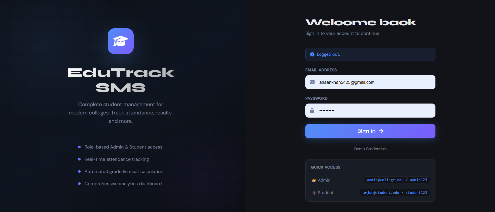
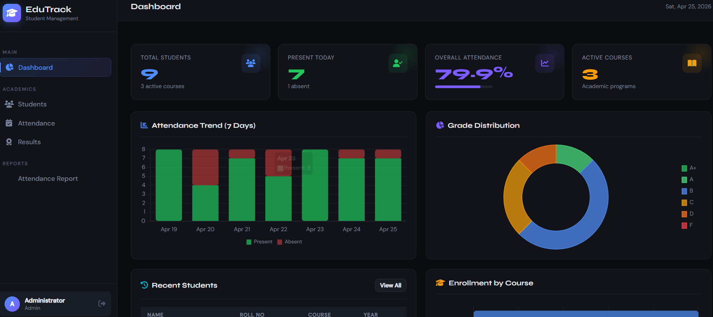
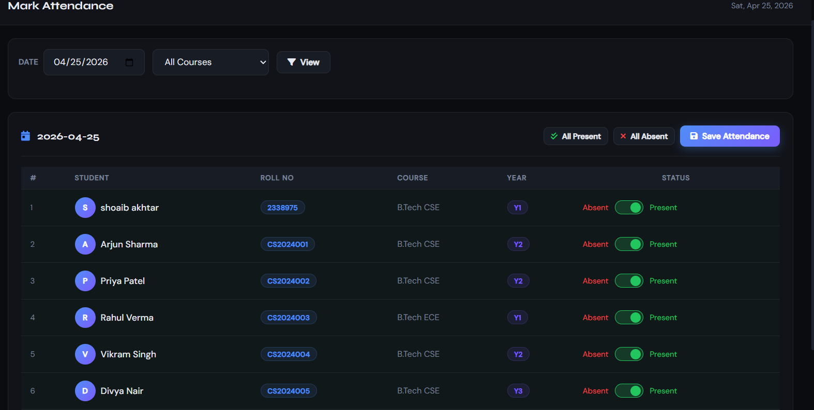
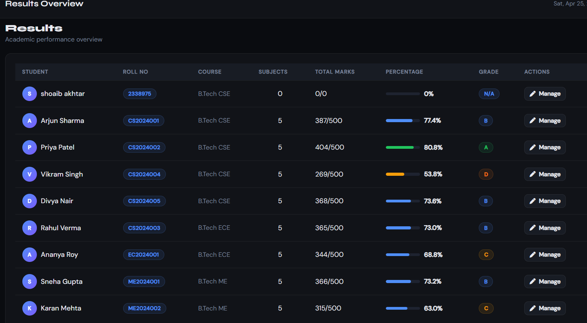

# EduTrack — Student Management System

## 📸 Screenshots

### 🔐 Login


### 📊 Dashboard


### ✅ Attendance


### 🏆 Results


---

A full-stack college Student Management System built with **Flask** and **SQLite**.

---

## Features

### 👑 Admin Panel
- **Dashboard** — live stats: total students, today's attendance, grade distribution charts, enrollment by course
- **Student Management** — Add, edit, delete, view students; search by name/roll no; filter by course/year; pagination
- **Attendance** — Date-wise toggle interface (Present/Absent per student); bulk mark all present/absent; filter by course
- **Results** — Subject-wise marks entry; auto percentage + grade calculation; update or delete entries
- **Reports** — Full attendance report with Good/Low/Critical status per student

### 🎓 Student Portal
- **Dashboard** — personal stats: attendance %, academic score, grade, recent activity
- **Profile** — view all personal details
- **Attendance** — full history with warning if below 75 %
- **Results** — subject-wise marks, percentage bar, grade; overall summary

### 🔐 Authentication
- Secure login/logout with password hashing (Werkzeug)
- Role-based access control (admin vs student)
- Flash messages for all user actions

---

## Project Structure

```
sms/
├── app.py                  ← Flask app, routes, DB helpers
├── run.py                  ← Startup script
├── requirements.txt
├── instance/
│   └── sms.db              ← SQLite database (auto-created)
└── templates/
    ├── base.html           ← Shared layout (sidebar, topbar, styles)
    ├── auth/
    │   └── login.html
    ├── admin/
    │   ├── dashboard.html
    │   ├── students.html
    │   ├── student_form.html
    │   ├── student_detail.html
    │   ├── attendance.html
    │   ├── attendance_report.html
    │   ├── results.html
    │   └── manage_results.html
    └── student/
        ├── dashboard.html
        ├── profile.html
        ├── attendance.html
        └── results.html
```

---

## Database Schema

| Table        | Key Columns                                              |
|--------------|----------------------------------------------------------|
| `users`      | id, name, email, password (hashed), role, student_id    |
| `students`   | id, name, roll_no, email, course, year, contact, dob     |
| `attendance` | id, student_id, date, status (Present/Absent)            |
| `results`    | id, student_id, subject, marks, max_marks, exam_type     |

---

## Grade Scale

| Grade | Range      |
|-------|------------|
| A+    | ≥ 90 %     |
| A     | 80–89 %    |
| B     | 70–79 %    |
| C     | 60–69 %    |
| D     | 50–59 %    |
| F     | < 50 %     |

---

## Setup & Run

### Requirements
- Python 3.8+
- Flask
- Werkzeug

### Install
```bash
pip install flask werkzeug
```

### Start
```bash
python run.py
# or
python app.py
```

Open **http://localhost:5000**

---

## Demo Credentials

| Role    | Email                   | Password     |
|---------|-------------------------|--------------|
| Admin   | admin@college.edu       | admin123     |
| Student | arjun@student.edu       | student123   |
| Student | priya@student.edu       | student123   |
| Student | rahul@student.edu       | student123   |

*(All student accounts use `student123` as default password)*

---

## Sample Data (auto-seeded on first run)

- **8 students** across B.Tech CSE, ECE, and ME
- **240 attendance records** (30 days, ~80 % present rate)
- **40 result entries** (5 subjects per student)
- **1 admin account**

---

## Tech Stack

| Layer     | Technology                      |
|-----------|---------------------------------|
| Backend   | Flask 3.x (Python)              |
| Database  | SQLite via sqlite3              |
| Frontend  | HTML5, CSS3, JavaScript         |
| Charts    | Chart.js 4                      |
| Icons     | Font Awesome 6                  |
| Fonts     | Syne + DM Sans (Google Fonts)   |
| Auth      | Werkzeug password hashing       |
